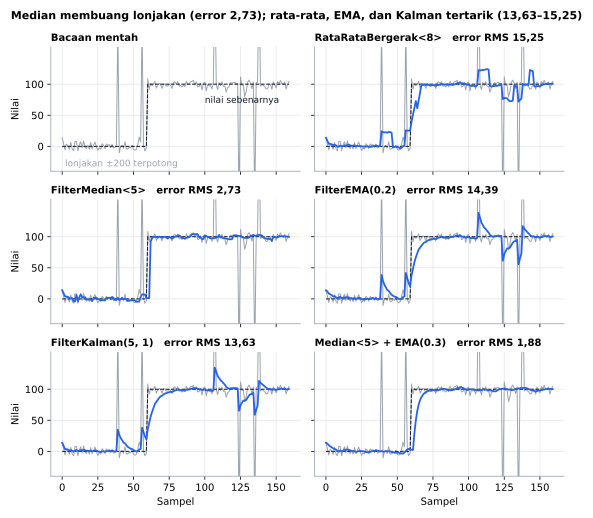
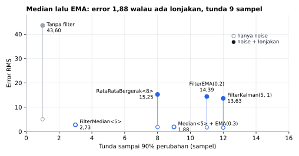
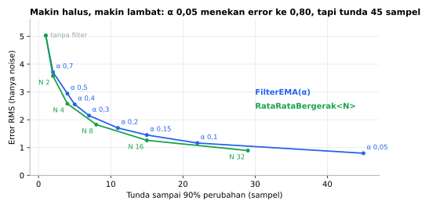

# FilterSensor (English)

[Bahasa Indonesia](README.md)

An Arduino library to **smooth noisy sensor readings**: moving average, running median, EMA, and 1D Kalman. Every filter is used the same way: `float smooth = filter.saring(reading);`. The API and examples are in Indonesian. This page maps every function to English.

```cpp
#include <FilterSensor.h>

FilterMedian<5> median;   // reject spikes
FilterEMA ema(0.2);       // smooth the rest

void setup() {
  Serial.begin(115200);
}

void loop() {
  float raw = analogRead(A0);
  float smooth = ema.saring(median.saring(raw));   // saring() = filter()
  Serial.println(smooth);
  delay(20);
}
```

## Why

- No dynamic allocation. Buffer size is a template parameter, so RAM shows up in the compile report.
- Correct from the first sample: before the buffer is full, the result is the average/median of the samples so far. EMA and Kalman start at the first reading, not at 0.
- The moving average recomputes its sum once per buffer cycle, so float rounding error does not accumulate.
- The median updates by shifting one value per sample instead of re-sorting the buffer.
- `FilterEMA::alphaDariWaktu(responseTime, sampleInterval)` computes alpha from a response time.
- Kalman noise is given in sensor units ("reading jumps ±0.5 degrees" → `0.5`).
- `NAN` readings (failed DHT read, HC-SR04 timeout) are ignored.

Logic test on PC (true value 100, noise σ = 5, fixed seed; *+spikes* adds 5% outliers of ±200; *lag* = samples to reach 90% of a 0 → 100 step):

| Filter | RMS error (noise) | RMS error (+spikes) | Lag | RAM (Uno) |
|---|---|---|---|---|
| None | 5.03 | 43.60 | 1 | |
| `RataRataBergerak<8>` | 1.83 | 15.25 | 8 | 38 B |
| `FilterMedian<5>` | 2.77 | 2.73 | 3 | 42 B |
| `FilterEMA(0.2)` | 1.70 | 14.39 | 11 | 9 B |
| `FilterKalman(5, 1)` | 1.61 | 13.63 | 12 | 16 B |
| median 5 + EMA 0.3 | 1.94 | 1.88 | 9 | 51 B |

## Simulation results

PC simulation with the same synthetic signal as the table above (not a hardware measurement).



The true value steps from 0 to 100 at sample 60. The median ignores the spikes; moving average, EMA, and Kalman are pulled by every outlier.



Hollow = noise only, filled = noise + spikes. Median followed by EMA is the smoothest spike-proof option, at 9 samples of lag.



Smaller alpha or larger N: smoother but slower. Regenerate with `cd extras/simulasi && python gambar.py` (needs g++ and matplotlib).

## Speed & memory

Measured with simavr (cycle-accurate ATmega328P simulator), Arduino Uno 16 MHz, full buffers. Cycles per `saring()` (filter) call.

| Filter | FilterSensor 1.0.1 | 1.0.0 | Competitor |
|---|---|---|---|
| Moving average 8 | 659 (41 µs) | 1,070 | RunningAverage 0.4.9: 1,054 (`getFastAverage`), 2,269 (`getAverage`) |
| Median 5 | 360 (22 µs) | 685 | RunningMedian 0.3.11: 1,255 |
| Median 15 | 606 (38 µs) | 1,343 | RunningMedian 0.3.11: 3,772 |
| EMA | 474 (30 µs) | 514 | EWMA 1.0.3: 462 |
| Kalman 1D | 1,575 (98 µs) | 1,725 | SimpleKalmanFilter 0.2.0: 1,798 |

RAM per object: 38 / 42 / 9 / 16 B, no heap (RunningAverage and RunningMedian use `malloc()`). Median is O(N) per sample (insertion into a sorted list), the others O(1). Since 1.0.1 the median compares float bit patterns as integers (2× faster) and the full moving average multiplies by `1/N`. EWMA is 12 cycles faster (no `NAN` rejection). Benchmark sketch: `extras/benchmark/FilterSensorBenchmark`.

## Function reference

| Indonesian | English | Notes |
|---|---|---|
| `RataRataBergerak<N>` | moving average | last N samples, 4N + 6 B |
| `FilterMedian<N>` | running median | N odd, 8N + 2 B |
| `FilterEMA(alpha)` | exponential moving average | alpha 0..1, 9 B |
| `FilterKalman(noiseUkur, noiseProses)` | 1D Kalman (measurement noise, process noise) | both in sensor units, 16 B |
| `saring(x)` | filter | add a sample, return the new result; `NAN` is ignored |
| `hasil()` | result | last result, 0 before the first sample |
| `reset()` | reset | |
| `FilterEMA::alphaDariWaktu(waktuRespon, intervalSampel)` | alpha from response time | 63% after the response time |
| `aturAlpha(alpha)` | set alpha | EMA |
| `aturNoise(noiseUkur, noiseProses)` | set noise | Kalman |

## Examples

`BandingkanFilter` (compare all filters in Serial Plotter), `PotensiometerHalus` (steady potentiometer), `JarakHCSR04Halus` (HC-SR04 without outliers), `SuhuAnalogHalus` (LM35 with Kalman), `MemilihFilter` (choosing a filter, runs without a sensor).

## Status

Version 1.0.1 passes automated logic tests on PC and compiles without warnings on Uno, ESP32, and STM32 Bluepill (CI covers 7 boards). The library is pure math. The sensor examples have **not yet been tried with real sensors**.

## License

MIT © 2026 Amadeo Wisesa.
